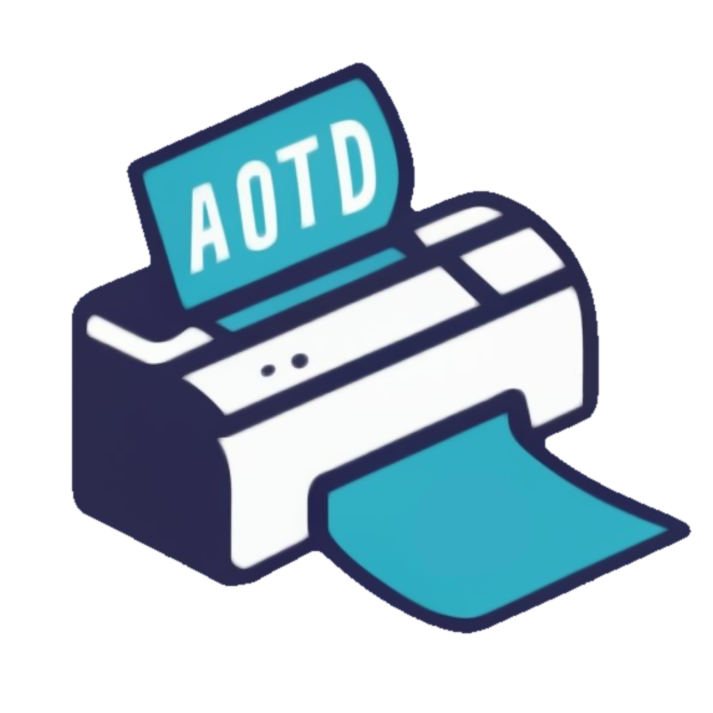
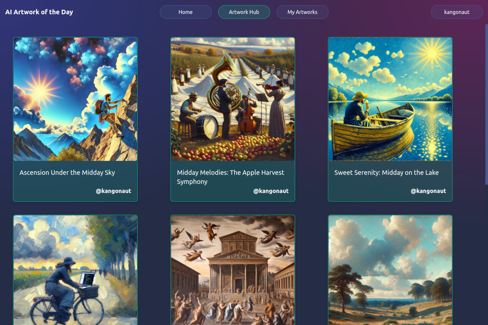

# AI Artwork of the Day

## Welcome!

AI Artwork of the Day is fun little side project designed to provide a **daily dose of creativity and inspiration**, all thanks to the power of AI. The aim is to generate AI artwork that encapsulates the essence of your day. Each artwork accounts for the weather, your calendar entries, the current daytime, and is spiced up using a randomly selected art style.

## Key Features

- **Daily Artwork:** receive daily AI-generated artwork that encapsulates your individual day
- **Artwork Personalisation:** image generation takes into account the user's current weather, calendar entries, daytime, and a random art style
  - **Weather:** retrieved from [OpenWeatherMap](https://openweathermap.org/) using user specified coordinates
  - **Calendar Entries:** entries are retrieved using the [CalDAV](https://en.wikipedia.org/wiki/CalDAV) protocol (no support for Google Calendar yet)
  - **Daytime:** determined using the user's timezone
- **Artwork Hub:** share your generated artwork with others
- **Push Notifications:** get your daily artwork straight to your mobile phone via [Pushover](https://pushover.net/)

## Technologies

This project is built with the following tools and technologies:

- [Django](https://www.djangoproject.com/): backend framework
- [SvelteKit](https://kit.svelte.dev/) with [Typescript](https://www.typescriptlang.org/): frontend framework
- [Skeleton](https://www.skeleton.dev/): UI toolkit
- [Celery](https://docs.celeryq.dev/en/stable/): distributed task queue
- [Redis](https://redis.io/): message broker for Celery
- [PostgreSQL](https://www.postgresql.org/): SQL database
- [LangChain](https://python.langchain.com/docs/get_started/introduction): LLM framework
- [GPT-4](https://openai.com/gpt-4): artwork prompt & title generation
- [DALL-E 3](https://openai.com/dall-e-3): artwork image generation

## Setup and Installation

TODO

## Usage

TODO

## Contributing

Feel free to fork the project, create a feature branch, and send me a pull request!

## License

This project is licensed under the [MIT License](https://github.com/Kangonaut/ai-artwork-of-the-day/blob/main/LICENSE).

## Contact

You can reach out to me through [Reddit](https://www.reddit.com/user/Kangonaut/). I'd love to chat about this project or any other interesting topics!

---

