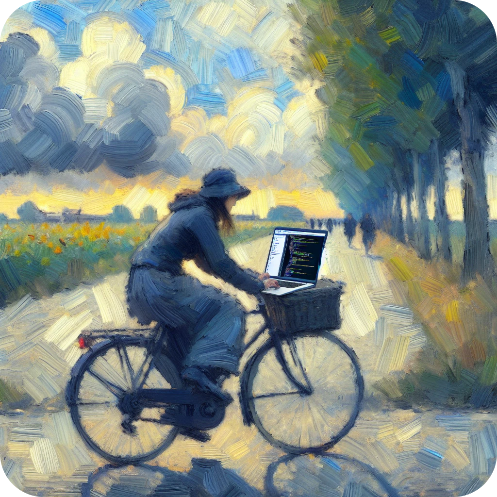
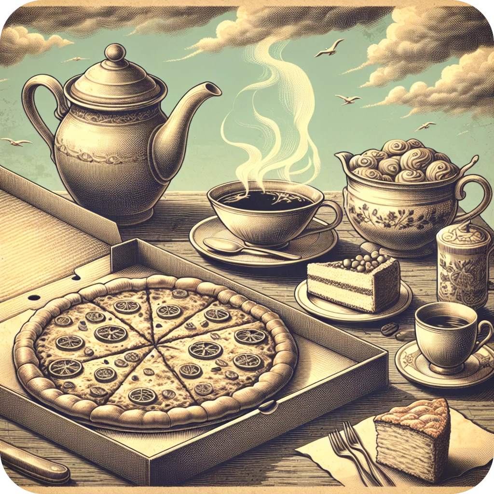

<div align="center">


# AI Artwork of the Day

[](https://github.com/Kangonaut/ai-artwork-of-the-day/blob/main/LICENSE)


</div>

## Table of Contents

+ [Welcome!](#welcome)
+ [Key Features](#key-features)
+ [Image Generation Process](#image-generation-process)
+ [Showcase](#showcase)
+ [Technologies](#technologies)
+ [Setup and Installation](#setup-and-installation)
+ [Usage](#usage)
+ [Contributing](#contributing)
+ [License](#license)
+ [Contact](#contact)

## Welcome! <a name="welcome"></a>

AI Artwork of the Day is fun little side project designed to provide a **daily dose of creativity and inspiration**, all thanks to the power of AI. The aim is to generate AI artwork that encapsulates the essence of your day. Each artwork accounts for the weather, your calendar entries, the current daytime, and is spiced up using a randomly selected art style.

## Key Features <a name="key-features"></a>

- **Daily Artwork:** receive daily AI-generated artwork that encapsulates your individual day
- **Artwork Personalisation:** image generation takes into account the user's current weather, calendar entries, daytime, and a random art style
  - **Weather:** retrieved from [OpenWeatherMap](https://openweathermap.org/) using user specified coordinates
  - **Calendar Entries:** entries are retrieved using the [CalDAV](https://en.wikipedia.org/wiki/CalDAV) protocol (no support for Google Calendar yet)
  - **Daytime:** determined using the user's timezone
- **Artwork Hub:** share your generated artwork with others
- **Push Notifications:** get your daily artwork straight to your mobile phone via [Pushover](https://pushover.net/)

## Image Generation Process <a name="image-generation-process"></a>


## Showcase <a name="showcase"></a>

### Baroque Sundown Delights

#### Data

```json
{
    "events":
    [
        "Ice Cream"
    ],
    "weather":
    {
        "general": "clear sky",
        "is_dew": "False",
        "is_rain": "False",
        "is_snow": "False"
    },
    "daytime": "evening",
    "art_style": "baroque"
}
```

#### Image Prompt

```
A baroque style painting of people eating ice cream under a clear sky in the evening.
```

#### Image

<div align="center">

<p style="font-style: italic">Baroque Sundown Delights</p>
</div>


### Impressions of a Coding Cyclist

#### Data

```json
{
    "events":
    [
        "Cycling Tour",
        "Programming"
    ],
    "weather":
    {
        "general": "overcast clouds",
        "is_dew": "False",
        "is_rain": "False",
        "is_snow": "False"
    },
    "daytime": "afternoon",
    "art_style": "impressionism"
}
```

#### Image Prompt

```
An impressionist painting of a person cycling in the afternoon under overcast clouds, with a laptop showing code in the background.
```

#### Image

<div align="center">

<p style="font-style: italic">Impressions of a Coding Cyclist</p>
</div>

### Ascension Under the Midday Sky

#### Data

```json
{
    "events":
    [
        "Rock climbing"
    ],
    "weather":
    {
        "general": "scattered clouds",
        "is_dew": "False",
        "is_rain": "False",
        "is_snow": "False"
    },
    "daytime": "midday",
    "art_style": "acrylic"
}
```

#### Image Prompt

```
An acrylic painting of a person rock climbing under a sky with scattered clouds at midday.
```

#### Image

<div align="center">

<p style="font-style: italic">Ascension Under the Midday Sky</p>
</div>

### Vintage Afternoon: Pizza, Coffee, and Cake

#### Data

```json
{
    "events":
    [
        "Pizza",
        "Coffee and Cake"
    ],
    "weather":
    {
        "general": "overcast clouds",
        "is_dew": "False",
        "is_rain": "False",
        "is_snow": "False"
    },
    "daytime": "afternoon",
    "art_style": "vintage"
}
```

#### Image Prompt

```
A vintage style image of an afternoon event with pizza and coffee with cake under overcast clouds.
```

#### Image

<div align="center">

<p style="font-style: italic">Ascension Under the Midday Sky</p>
</div>

## Technologies <a name="technologies"></a>


This project is built with the following tools and technologies:

- [Django](https://www.djangoproject.com/): backend framework
- [SvelteKit](https://kit.svelte.dev/) with [Typescript](https://www.typescriptlang.org/): frontend framework
- [Skeleton](https://www.skeleton.dev/): UI toolkit
- [Celery](https://docs.celeryq.dev/en/stable/): distributed task queue
- [Redis](https://redis.io/): message broker for Celery
- [PostgreSQL](https://www.postgresql.org/): SQL database
- [LangChain](https://python.langchain.com/docs/get_started/introduction): LLM framework
- [GPT-4](https://openai.com/gpt-4): artwork prompt & title generation
- [DALL-E 3](https://openai.com/dall-e-3): artwork image generation

## Setup and Installation <a name="setup-and-installation"></a>

TODO

## Usage <a name="usage"></a>

TODO

## Contributing <a name="contributing"></a>

Feel free to fork the project, create a feature branch, and send me a pull request!

## License <a name="license"></a>

This project is licensed under the [MIT License](https://github.com/Kangonaut/ai-artwork-of-the-day/blob/main/LICENSE).

## Contact <a name="contact"></a>

You can reach out to me through [Reddit](https://www.reddit.com/user/Kangonaut/). I'd love to chat about this project or any other interesting topics!

---

<div align="center">
<a href="https://www.buymeacoffee.com/kangonaut" target="_blank"></a>
</div>